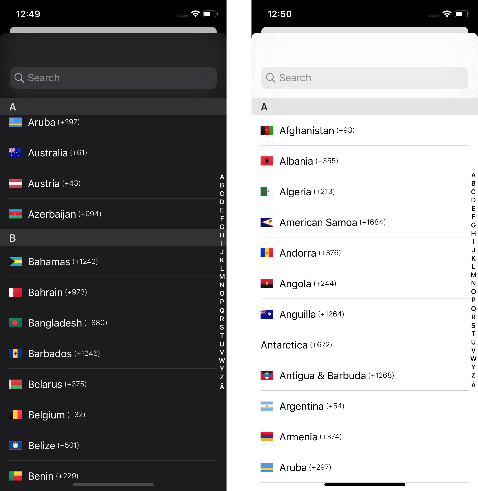

[](https://travis-ci.org/danielhorv/DHCountryPicker)
[](https://codecov.io/gh/danielhorv/DHCountryPicker)

# DHCountryPicker

Country Picker with dial code and flag for iOS.

* Localization ✅
* DarkMode support ⚫️⚪️

## Screenshots


## Usage 

### Initialization:

If you only want to present a picker and get the selected value you have to initialize a `DHCountryPickerViewController` and set the delegate property.

```swift
let countryPickerViewController = DHCountryPickerViewController()
countryPickerViewController.delegate = self
present(UINavigationController(rootViewController: countryPickerViewController), animated: true, completion: nil)

````

If you need the selected country before showing the picker, you can use the `current` property of `DHCountryProvider`.
```swift
let countryProvider = DHCountryProvider()
selectedCountryLabel.text = countryProvider.current.localizedName
selectedCountryFlagImageView.image = countryProvider.current.flag

let countryPickerViewController = DHCountryPickerViewController(provider: countryProvider)
````

When the user changed the country, you can store it and next time present the picker with this value.
```swift
var selectedCountry: Country? // you can update this in the delegate method
let countryPickerViewController = DHCountryPickerViewController(selectedCountry: selectedCountry)
````

### Available ViewController settings:
* `autoDismissOnSelect` - default `true` - automatically dismiss the picker on selection
* `isDialCodeHidden` - default `true` - show/hide the dial codes
    
```swift
let countryPickerViewController = DHCountryPickerViewController()
countryPickerViewController.autoDismissOnSelect = false
countryPickerViewController.isDialCodeHidden = false
````

## Installation
**CocoaPods:**

```
pod 'DHCountryPicker'
```

## Requirements
- Swift 5
- iOS 11

## Built With

* [FlagKit](https://github.com/madebybowtie/FlagKit) - Flag images [@madebybowtie](https://github.com/madebybowtie)
* [CountryCodes](https://gist.github.com/Goles/3196253) - Dial codes [@Goles](https://gist.github.com/Goles)

## Authors

* **Daniel Horvath** - [Twitter](https://twitter.com/picipuma)

## License

This project is licensed under the MIT License - see the [LICENSE.md](LICENSE.md) file for details
